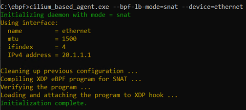
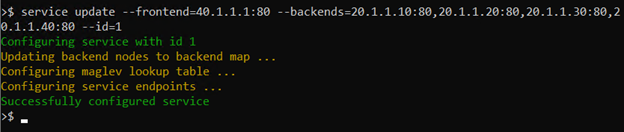
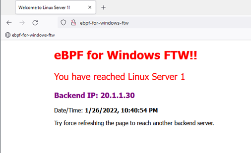
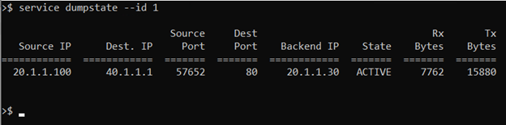
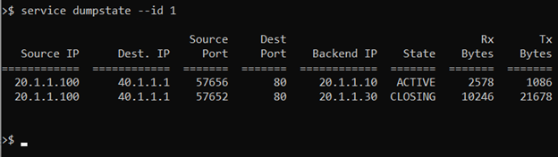

# Cilium L4 Load Balancer using eBPF-for-Windows

## Introduction

This document describes the details about and the steps needed to run Cilium L4 load balancer using eBPF-for-Windows. Cilium solution provides many features and functionalities, which also includes an external load balancer. For the demonstration, we are only using the external load balancer functionality of the Cilium solution. The external load balancer uses XDP hook to implement the load balancing. Cilium L4LB solution supports both SNAT and DSR modes, and this demo demonstrates both the modes using eBPF-for-Windows. 

Cilium solution consists of two parts: 

1. XDP eBPF program which implements the L4LB functionality. 
2. User mode daemon (agent) and a CLI for installing and configuring the XDP eBPF program and LB service instances. 

This demo uses the same Cilium XDP code which implements the load balancing and runs it using eBPF-for-Windows. For porting the Cilium XDP code to eBPF-for-Windows, some changes were needed to the original Cilium XDP code. For the user mode agent, this demo uses a custom Cilium-based agent which is inspired from the Cilium user mode agent/CLI.

The below sections provide more detail about these changes. 

## Changes to Cilium XDP BPF Code 

To make Cilium XDP eBPF program to compile and run using eBPF-for-Windows, few changes were required in the XDP code. Following is the list of main changes done to the Cilium XDP code:
1. Map definition used in Cilium is different that the definition used in ebpf-for-windows. Changed map definitions to match with the ones supported by eBPF-for-Windows.
2. fib_lookup support: eBPF-for-Windows does not yet support fib_lookup helper function. XDP code was modified to comment out calls to fib_lookup helper function. Cilium XDP code already has support to first read neighbor entries from a map if they are available. For demo, the custom cilium-based agent populates this map so that XDP program can get the next hop addresses from the map, and there is no need for call to fib_lookup.
3. xdp_adjust_tail support: In Cilium L4LB code, this helper function is used for sending ICMP error messages in case of DSR. Since eBPF-for-Windows does not yet have support for this helper function, disabled ICMP ERROR functionality.
4. Disabled other optional functionalities like source range check, some statistics and diagnostics functionality. 

## User Mode Demo Agent

The demo uses a custom user-mode agent which is inspired from the Cilium agent and CLI. The Cilium user mode agent and CLI supports many functionalities and has dependencies on many packages, some of which are Linux specific. So, it is not trivial to directly compile and use the Cilium agent and CLI on Windows. 

The demo agent performs similar operations as the Cilium agent like:
1. Compiling, loading, and attaching the XDP eBPF program.
2. Taking a service configuration as input and programming the required eBPF maps for load balancing to work.

Apart from the above operations, the demo agent also provides some extra commands to:
1. Change the mode from SNAT to DSR and vice-versa.
2. State dump to show the current "active connections" by querying the appropriate eBPF maps and displaying the information.

## Setup Preparation

The following sections provide all the steps to prepare a setup to run Cilium L4LB using eBPF-for-Windows. This demo uses a web server (running on all backend nodes) to demonstrate load balancing and a client will connect to the website using the VIP.

### Build eBPF-for-Windows and demo agent

The demo agent code is present in a [fork repository](https://github.com/saxena-anurag/ebpf-private/tree/anurag/lb) of the [eBPF-for-Windows](https://github.com/microsoft/ebpf-for-windows) repository. The modified Cilium XDP code is present in another [fork repository](https://github.com/saxena-anurag/cilium/tree/anurag/cilium_xdp_bpf_code_changes) of the [Cilium](https://github.com/cilium/cilium) repo. The eBPF-for-Windows fork references the Cilium fork repo as a submodule.

To clone and build the ebpf-for-windows fork project, follow the [Getting Started](https://github.com/microsoft/ebpf-for-windows/blob/master/docs/GettingStarted.md) guide. Build the whole ebpf-for-windows solution for amd64/Release.

**Note**: The above Getting Started link mentions cloning of official eBPF-for-Windows project, but we need to clone the fork repo. Rest of the steps are same.

The daemon code is present in the following path: ``demo\daemon``. Once the whole solution has been built, all the required files will be present in ``x64\Release`` folder under the root project path.


### Prepare Demo Setup

For demonstration, 1 VM is required for the load balancer and a few VMs for backend nodes. The backend nodes can be either Windows VMs or Linux VMs or a mix of both. This document assumes there are 4 backend VMs - 2 Windows VMs and 2 Linux VMs. Hence there are 5 VMs in total. All the VMs are on the same host and connected via an internal switch. Since it is an internal switch, the host is also connected to the VMs and will be used as a client to initiate traffic.

**Note**: The number and type (Windows vs. Linux) of backend VMs can be changed accordingly for a demo.

#### Create VMs

1. Create an internal switch on the host and assign IP ``20.1.1.100`` to the host vNIC. Host will act as a client.
2. Create 5 VMs on a single host with one network interface each. 3 of the VMs will be Windows VMs and 2 Linux VMs.
3. Assign IP ``20.1.1.1`` to the LB node VM
4. Assign Ips `20.1.1.10` and `20.1.1.20` to the 2 Windows backend VMs
5. Assign Ips `20.1.1.30` and `20.1.1.40` to the 2 Linux VMs.

The demo will use ```40.1.1.1``` as the LB VIP.

#### Setup LB node

The following steps describe how to setup the LB node VM:
1. Install [Clang 10.0](https://github.com/llvm/llvm-project/releases/tag/llvmorg-10.0.0). Download ``LLVM-10.0.0-win64.exe``
2. Ensure Clang is added to system path.
3. Enable test signing by running command ``"bcdedit -set testsigning on"``
4. Create a folder ``C:\ebpf`` and copy all the files from the build directory mentioned above to ``C:\ebpf``
5. Go to ``C:\ebpf`` and execute ``"install_ebpf.bat"``. This will install the ebpf-for-Windows framework on the LB node.

#### Setup Windows Backend Node(s)

This section describes how to configure the Windows backend nodes. For DSR mode, backend nodes will receive an IP-in-IP packet, and we need some eBPF program to decap those packets. On Windows backend nodes, the demo will use an XDP sample program (ebpf-for-windows/decap_permit_packet.c at master · microsoft/ebpf-for-windows (github.com) to decap IP-in-IP packets. The sample is present in eBPF-for-Windows project. Following are the steps to setup the Windows backend nodes:

1. Enable test signing on the node by running command ``"bcdedit -set testsigning on"``
2. Create a folder ``C:\ebpf`` and copy the all the files from the build directory mentioned above to ``C:\ebpf``
3. Go to ``C:\ebpf`` and execute ``"install_ebpf.bat"``. This will install the ebpf-for-Windows framework.
4. Load the XDP decap program using command ``netsh ebpf add program decap_permit_packet.o pinpath=ipip_decap``
5. Add VIP ``40.1.1.1`` to loopback interface.
6. Enable ``weakhost send`` and ``weakhost receive`` on both loopback and the external interface using the following command: ``Set-NetIPInterface -ifIndex <ifindex> -WeakHostSend Enabled -WeakHostReceive Enabled``
7. Once ebpf is installed on Windows backend node, install IIS on the Windows backend from the server manager and configure a website. 
8. A sample html page is present in the eBPF-for-Windows fork repository [here](https://github.com/saxena-anurag/ebpf-private/blob/anurag/lb/demo/html/index.html). This sample can be used and modified for each backend node for this demo.

#### Setup Linux Backend Node(s)

As with Windows backend node, for DSR mode, the Linux backend node also requires some eBPF program to decap IP-in-IP packets. The demo uses a TC based eBPF program to decap the IP-in-IP packets. The sample eBPF program is available in [Cilium repository here](https://github.com/cilium/cilium/blob/ba4e73d86dc36f5c5cbe5f17cf00b07ba4a983ff/test/l4lb/test_tc_tunnel.c). A compiled object file (compiled on Ubuntu Linux) is also checked-in in the eBPF-for-Windows fork repository [here](https://github.com/saxena-anurag/ebpf-private/blob/anurag/lb/demo/decap/test_tc_tunnel.o).

Following are the steps / commands to setup the Linux backend node:
1. Install nginx and setup a basic web page. The sample web page can be used to create the basic web page.
2. Assign the backend IP to the VM interface.
3. Assign the VIP to the loopback interface using the following command: ``sudo ip a a dev lo 40.1.1.1/32``
4. Install TC based ebpf program to decap IP-in-IP packets using the following commands:
    1. ``sudo tc qdisc add dev eth0 clsact``
    2. ``tc filter add dev eth0 ingress bpf direct-action object-file ./test_tc_tunnel.o section decap``

#### Setup Host as Client

Install [Mozilla Firefox](https://www.mozilla.org/en-US/firefox/new/) browser on the host which will act as a client to connect to the load balanced website.
Add a route on the host vNIC with destination ``40.1.1.1/32`` (VIP) and next hop as ``20.1.1.1`` (LB node IP). This route will ensure all traffic originating on host destined to ``40.1.1.1`` will be forwarded to the LB node.

## Running Cilium L4LB XDP program

### Compiling / Loading eBPF Program
Once the LB node, backends and the host have been configured, use the following command to launch the cilium-based agent in SNAT mode on the LB node:

``cilium_based_agent.exe --bpf-lb-mode=snat --device=ethernet``



The above command will compile the XDP program for SNAT mode. It will then use eBPF-for-Windows framework to verify the program, load, and attach the program to the XDP hook. Once the program has been attached to the XDP hook, the agent will provide a CLI to configure LB service instance.
Next step is to configure a LB service instance using the following command:

``service update --frontend=40.1.1.1:80 --backends=20.1.1.10:80,20.1.1.20:80,20.1.1.30:80,20.1.1.40:80 --id=1``



The above command will configure a service with frontend IP ``40.1.1.1`` and port 80 and 4 backends with their respective IPs. 
Once the LB service instance has been configured, use the browser on the host to connect to ``http://40.1.1.1``. This should hit one of the backend nodes.



### Statistics
The user mode agent provides a ``"dumpstate"`` command to display the current active connections and their statistics. On the user mode agent CLI, run the following command: ``service dumpstate --id 1``. The output looks like the following:



### Force Refresh
Doing a force refresh of the browser ``(Shift-Ctrl-R)`` will force the browser to use a different source port, which will most likely cause a different backend to be chosen. Once the browser connects to a different backend, the webpage will display the new backend information and the new connection statistics will look something like this:



### Changing Mode to DSR
User mode agent provides the following command to change the mode to DSR: ``mode update dsr``.
Running the above command recompiles the eBPF program for DSR mode, verifies, loads, and re-attaches the program to XDP hook. It then reconfigures the previously configured LB service instance.
Once the XDP program has been re-attached for DSR mode and the LB service instance had been reconfigured by the above command, refreshing (and / or force-refreshing) the webpage should again hit some backend but in DSR modes.

### Network Activity
Packet capture tools like ``Wireshark`` can be installed on the LB node to inspect the packets. 
In case of SNAT mode, Wireshark will show both the request and the response packets on the LB node. The packets from the LB node to a backend node (and back) would be source NATed packets.
In case of DSR mode, Wireshark will only show the request packets, and no response packets will be seen as the response will directly go from backend node to the client in case of DSR.
